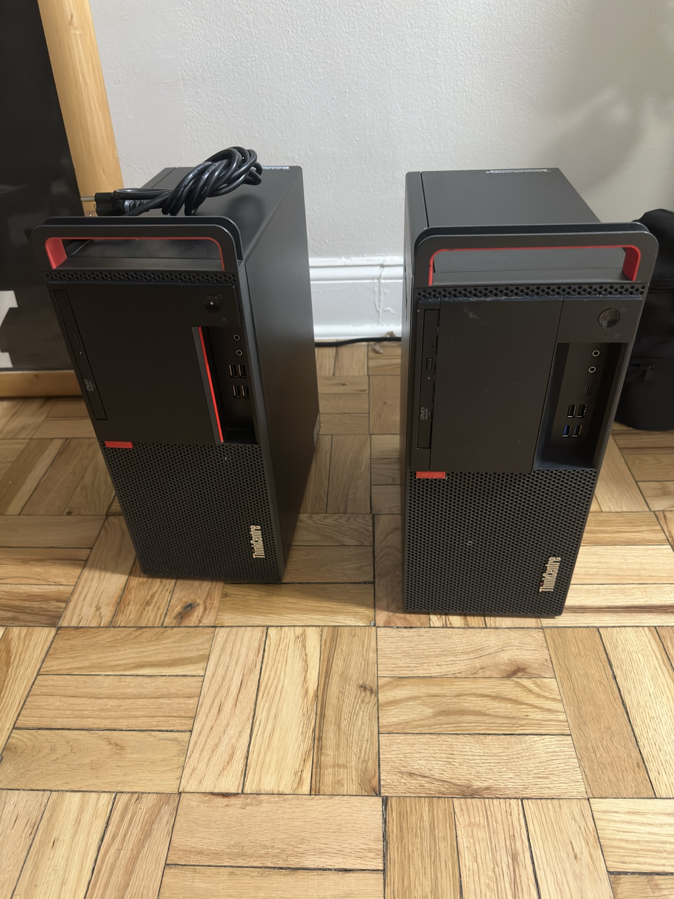
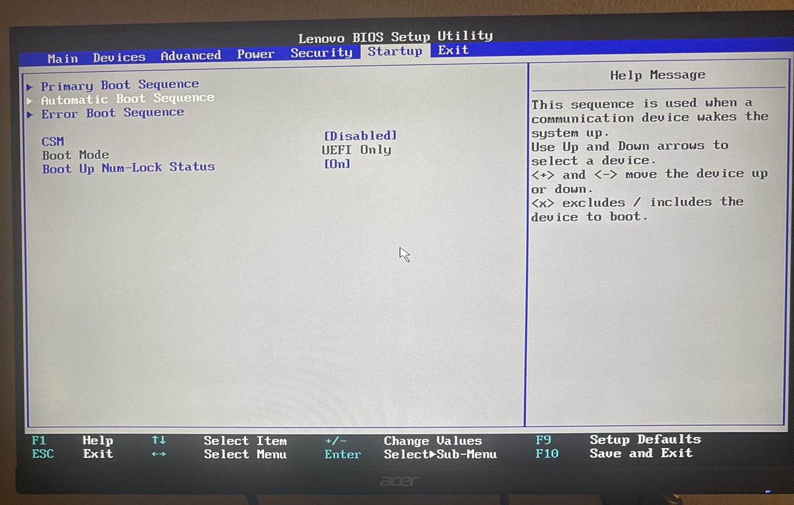
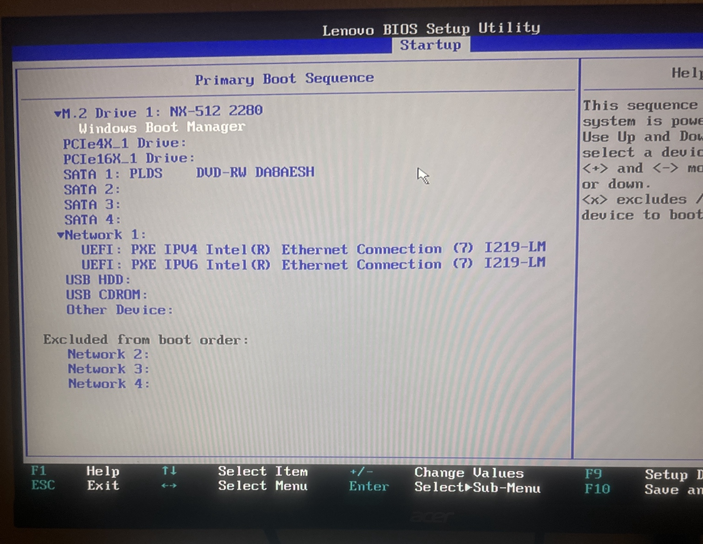
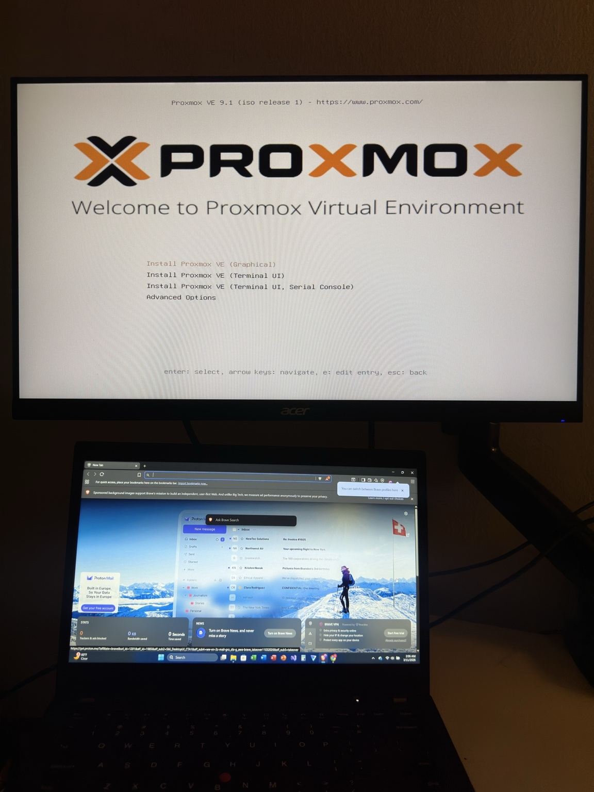
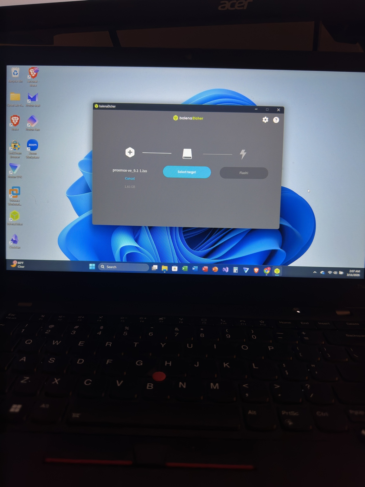
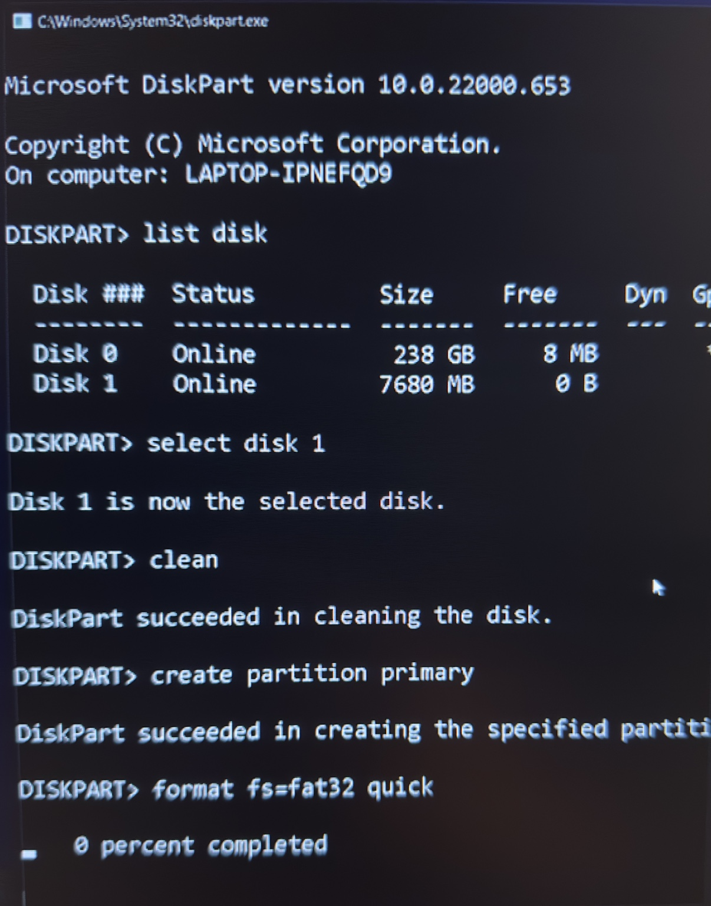
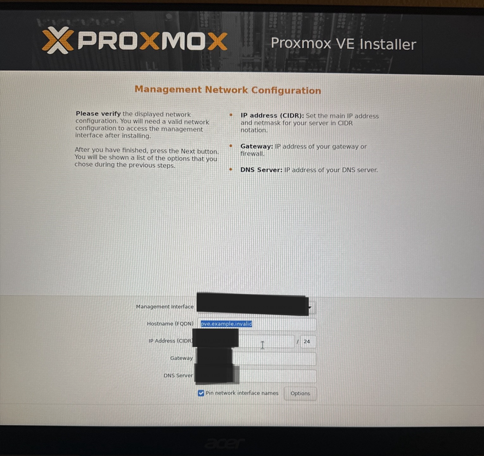

# Lenovo M920 Homelab Build: Proxmox Installation and Ubuntu Server VM Deployment

## Project Overview

This project documents my setup of a Lenovo M920 as a dedicated Proxmox virtualization host for my cybersecurity homelab. The goal of this build was to prepare a reliable system for running virtual machines, practicing server administration, and expanding my hands-on experience with virtualization and infrastructure.

The project included system validation, BIOS checks, boot media troubleshooting, installation of Proxmox, remote dashboard access, and creation of an Ubuntu Server virtual machine.

---

## Project Goals

- Repurpose a Lenovo M920 into a Proxmox VM host  
- Confirm hardware and BIOS settings were suitable for virtualization  
- Prepare and repair USB installation media  
- Install Proxmox successfully on bare metal  
- Access the Proxmox web interface from another lab node  
- Deploy an Ubuntu Server virtual machine  

---

## Hardware Used

- Lenovo M920
- USB flash drive
- Secondary lab node for remote management
- Network connection for dashboard access

---

## Software Used

- Windows
- Command Prompt
- DiskPart
- BalenaEtcher
- Proxmox VE
- Ubuntu Server ISO

---

## Skills Demonstrated

- BIOS validation and configuration
- Virtualization readiness verification
- Disk and USB troubleshooting
- Command-line disk management
- Hypervisor installation
- Remote system administration
- Virtual machine provisioning
- Technical documentation

---

## Step-by-Step Build Process

### 1. Initial Hardware Power-On and Validation

I connected the power cable to the Lenovo M920 and plugged it into an AC outlet. The machine powered on successfully.

Because the M920 was going to be used as a dedicated Proxmox VM host, I first verified that the system was operating properly and matched the expected hardware specifications.

---

### 2. Windows Cleanup Before Installation

Before beginning the Proxmox installation process, I removed programs and background applications that were not needed. This was done to prepare the system before installing the hypervisor.

---

### 3. BIOS Access and Virtualization Checks

I restarted the machine and entered BIOS by pressing **F1** during startup when the Lenovo logo appeared.

Inside BIOS, I verified:

- hardware matched the listing description
- there were no unexpected boot passwords
- boot settings were configured correctly
- **UEFI mode was enabled**
- **CPU virtualization was enabled**
- boot order allowed USB boot

After confirming these settings, I saved the configuration using **F10** and rebooted.

---

### 4. Hardware Verification in Windows

After Windows booted, I confirmed that the information shown in BIOS matched the system information inside Windows.

I verified:

- **System settings**
- **Task Manager → Performance tab**

This allowed me to confirm the CPU and memory specifications before proceeding with the Proxmox installation.

---

### 5. Proxmox ISO Preparation

Next, I downloaded the **Proxmox VE ISO** and prepared a USB flash drive for installation.

However, the USB drive had previously been used for another Linux ISO and Windows could not recognize it properly. The system returned errors when attempting to format the drive.

---

### 6. USB Troubleshooting with DiskPart

To repair the USB drive, I opened **Command Prompt as Administrator** and used the DiskPart utility.

Commands used:

```
diskpart
list disk
select disk X
clean
create partition primary
format quick fs=fat32
exit
```

Replace **X** with the correct disk number for the USB drive.

This removed the previous partitions and restored the drive so Windows could recognize and use it normally again.

---

### 7. Flashing the Proxmox Installer

Once the USB drive was functioning correctly, I used **BalenaEtcher** to flash the Proxmox ISO to the drive.

After the flash completed, I safely ejected the USB drive.

---

### 8. Booting From USB and Installing Proxmox

I inserted the prepared USB drive into the Lenovo M920 and accessed the boot menu by pressing **F12** during startup.

From the boot menu I selected the USB device and launched the **Proxmox installer**.

The installation process completed successfully and the hypervisor was configured for use as a homelab virtualization node.

---

### 9. First Login and Dashboard Access

After installation finished, I logged into the system using the credentials created during setup.

I then accessed the **Proxmox web dashboard** from another lab node using a web browser. This confirmed that the hypervisor installation and network configuration were working correctly.

---

### 10. Creating the First Virtual Machine

For the first VM, I downloaded the **Ubuntu Server ISO**.

Inside Proxmox I selected **Create VM**, attached the Ubuntu Server ISO, configured the virtual machine settings, and started the VM successfully.

This confirmed that the Lenovo M920 was functioning correctly as a virtualization host.

---

### 11. Ubuntu Server VM Deployment

An Ubuntu Server VM was successfully deployed on the Proxmox host. This server will be used for future lab projects including Linux administration, networking, and security testing.

---

## Troubleshooting Highlight

The primary issue encountered during this setup involved the USB drive used for the Proxmox installation.

Because the flash drive had previously been used for a Linux installer, Windows could not properly format or access the device. Using **DiskPart to clean the disk and recreate the partition** resolved the issue and allowed the Proxmox installation to proceed.

This troubleshooting step demonstrates the importance of understanding low-level disk utilities when preparing installation media.

---

## Outcome

By the end of this project I successfully:

- validated Lenovo M920 hardware
- confirmed BIOS virtualization configuration
- repaired and reused a USB installation drive
- installed Proxmox VE on bare metal
- accessed the Proxmox web interface remotely
- deployed an Ubuntu Server virtual machine

This marks an important step in building my cybersecurity homelab infrastructure.

---

## What I Learned

From this project I learned:

- how to validate used hardware before repurposing it
- how BIOS settings affect virtualization
- how to repair USB installation media using DiskPart
- how to install and manage Proxmox
- how to create and deploy virtual machines
- the importance of documenting technical work

---
## Build Process Screenshots

### Lenovo M920 Hardware


### BIOS UEFI Configuration


### BIOS Boot Order


### Proxmox Installer


### Flashing Proxmox ISO with BalenaEtcher


### Repairing USB Drive Using DiskPart


### Proxmox Network Configuration



## Why This Project Matters

This project helped me build hands-on experience with hardware validation, BIOS configuration, installation media troubleshooting, Proxmox deployment, and virtual machine creation. It also strengthened my understanding of how virtualization platforms support cybersecurity lab environments.

---

## Next Steps

Planned future improvements for this homelab include:

- deploying additional virtual machines
- expanding Linux server administration practice
- building segmented lab roles
- adding security monitoring tools
- documenting future VM builds and network architecture

---
